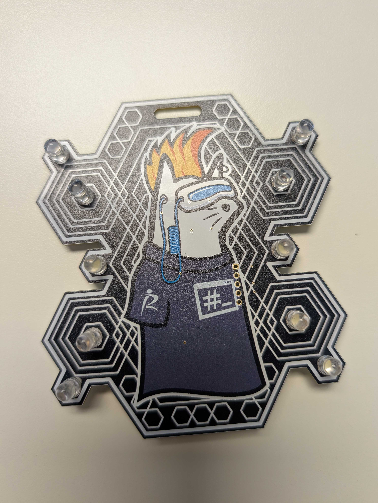

# RII badge
This is the repo accompanying the Research Innovations Incorporated (RII)
badge, debuting at RE//verse 2025. Because RII is providing the badges fully
assembled, assembly instructions are located at the bottom of the README for
anyone interested (or anyone building from a provided kit in the future).

This README prioritizes features of the badge and how to modify it. By picking
up a badge from the RII booth, you agree to make a good-faith effort to
participate in one (or both) of the available activities.

During RE//verse, we will host a March Madness style bracket competition for
the best light show you can flash onto the badge. We will randomly pick
brackets. The qualification of "best light show" is purely subjective---decided
by the RII booth.

Additionally, as the text on the badge indicates, you can unlock a new light
pattern on your badge by reverse engineering the code on the PIC16. Contact the
RII booth to get an Intel HEX representation of your badge's code.

> **_NOTE:_** The LEDs are very bright! Please be respectful and avoid pointing
lights directly into others' eyes. Ensure your badges are not a distraction to
RE//verse speakers, especially if you are in the front section of seating.

## Why this badge?
In addition to our cutting-edge program work, RII has a culture of growth and
[mentoring](https://www.researchinnovations.com/post/mentoriing-mentality). Our
[Core Values](https://www.researchinnovations.com/core-values) include specific
statements to help engineers pursue their passions (e.g., "Let your geek flag
fly" and "while (true) { learn(); think(); share(); innovate(); }"). As part of
the creation process for these badges, we included members of our team that
might not have had experience in hardware design, soldering, or microcontroller
programming. This exposure provides hands-on experience to further increase
skill sets as well as prepare them for program work where those skills might be
necessary.

We are excited about the inaugural RE//verse Conference, which is full of great
presenters on a single track. We anticipate most attendees will be present at
every talk. However, we wanted to provide a manageable side quest for attendees
to work on if they want a break from the main action. Although there are many
other more complex and technically impressive badges, this badge is simple
enough to be digestible within the timeframe of the conference. Additionally,
PIC16 is an architecture most people might not have worked with. We intend this
to be a fun, collaborative, low-stakes activity and look forward to seeing what
you can create!

You are welcome to hang out with us at our sponsor booth during the conference.
If you are interested in career opportunities at RII, check out our [careers
page](https://www.researchinnovations.com/careers).

## Modifying the badge
The high-level workflow to modify your badge follows:
- Install the IDE for PIC development and flashing.
- Set up some configuration options.
- Write/build your C or assembly code.
- Come to the RII booth to flash your badge with our PICKit3.

### Install the IDE
Install the MPLAB X IDE using an installer from Microchip at
https://www.microchip.com/en-us/tools-resources/develop/mplab-x-ide. You only
need support for the 8-bit microcontrollers (XC8) and should only need the IDE
and not the IPE.

### Make a new project
- Choose the "Microchip Embedded" Category and "Application Project(s)" Project
- Select "Baseline 8-bit MCUs" as the family and the "PIC16F54" as the Device
- For development, you can ignore the "Tool" option.
- If you are writing C code, you want the XC8 compiler.  If you are writing
  assembly, you want the pic-as assembler.
- Name project as you desire, click finish

### Editing source code
- Right click "Source Files"->"New"->"main.c"
- Replace the contents of main.c with the main.c in this repo
- In your source code, you'll need to set the configuration bits. You want WDT
  Disabled, Code Protection disabled, and the oscillator set to RC. This is
  already done using "#pragma" statements in the provided code.

### Write code
You can write whatever code you'd like to make custom light shows! This repo
includes the C code used for the default badge configuration, which provides an
example to modify or build upon. The PIC16F54 is simple; however, you are
programming the pins using I/O ports, and it can be a little different than you
might expect.

If you get a message like "Can't find 0xXXX words for psect 'dataBANK0'", your
code is too big to fit in flash memory. The PIC16F54 only fits 512 12-bit words
in program memory, and a mere 25 8-bit words in data memory. Refactor your code
to reduce size, and you can write more compact code using assembly instead of
C.

### Flash badge
Select the "PICkit 3" as your "connected hardware tool" (you'll need to select
"Show All" if the PICkit is not attached to your computer) In the PICkit 3
menu, select the "Power" option category. Enable "power target circuit from
PICkit3" and set voltage level to 3.5V.

Connect a PICkit 3 to the 5-pin ICSP header and click "make and program device
main project". We leave the details of this as an exercise to the reader.

At RE//verse, you may email your .hex file to an RII booth member, and we will
flash your badge for you.

#### Troubleshooting
- Remember to switch the badge off before attempting to flash. Battery power
  will conflict with PICkit 3 power and cause programming to fail (hardware
  should be ok).
- Make sure you have configured the PICkit 3 to provide 3.5-4.5 volts in the
  IDE settings. Lower voltage tends to cause programming instability.
- If the badge is flaky, specifically turning on/off inconsistently, you
  probably need a better solder connection for the slide switch (especially the
  top 4 pins).

## Reverse engineering
Although the source code provided in this repo matches the flashing pattern on
your badge and is a great place for you to start your own modifications, it
does not exactly match what is on your badge as you received it. If you reverse
engineer the badge code, you will find a way to unlock a new light pattern.
Details here are intentionally sparse, but please talk to us at our booth if
you have questions or need ideas.

## Assembling the badge
Tips for assembling the badge follow.

### Kit contents
1x  PIC16F54 microcontroller
1x  10k ohm resistor
1x  200 microfarad capacitor
1x  CR2032 battery
1x  Battery mount
1x  5-pin header
1x  Switch
10x LEDs

### Recommended assembly order
It's easiest to assemble a PCB on a flat surface. Save the LEDs as the last
component to add. Start with the resistors and capacitor, so the smallest
components are set. Do the PIC16F54 next, so you have room all around it to
solder the individual legs without bumping into other raised components. Check
for any bridged pins and check that relevant pins are all connected to the
respective LED pads. Attach the slide switch and then the battery holder.
Insert all LEDs, bend the legs to hold their place but do not solder. Insert
battery and push slide switch up to check that all LEDs light. Solder LEDs,
trim legs, and enjoy!

### Assembly Tips
- It is much easier to use solder paste instead of solder wire for the
  resistors, capacitor, and PIC16. Just a tiny bit of solder paste on the outer
  half of each pad is enough. Too much, or paste on the inside edge of the pads,
  tends to cause bridged pins.
- If the PIC16 gets programmed successfully but doesn't actually do anything
  when powered on, the problem is almost always the RC oscillator circuitry.
  Check the capacitor, 10k Ohm resistor, and the PIC16 oscillator input pin.

## Acknowledgements
RJ (crandyman): Concept, circuitry, component selection, badge assembly, software

Frankl: Badge design, graphics, concept support

Joey Villa: Badge assembly

Zack Chapman: Badge assembly

curiouspiano: Badge assembly

